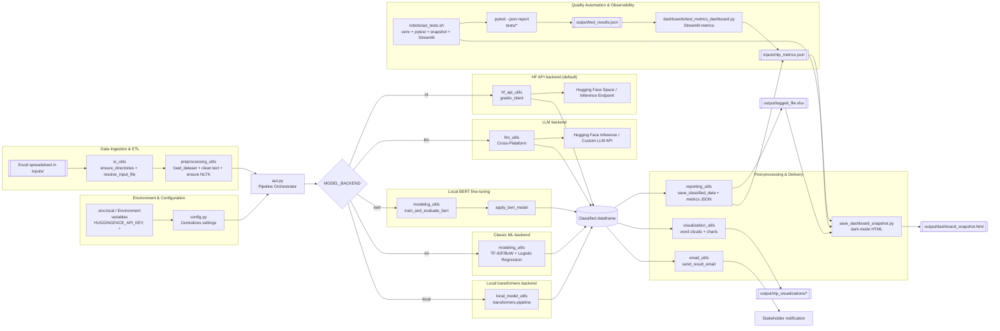

<span align="justify">

# Overview

This project classifies SISAGUA water-quality records to decide if each source is fit for consumption. It is fully open source, maintained in public, and distributed under the MIT License so agencies and communities can adapt it to their own monitoring workflows. The pipeline supports multiple backends:

- **Classic ML**: Bag-of-Words / TF-IDF + Logistic Regression with feature importance reports.
- **BERTimbau (Hugging Face)**: fine-tunes `carlosdelfino/eli5_clm-model` on your labeled samples.
- **Hugging Face API (default)**: each row is sent to a hosted Space/model via `gradio_client`/HF inference using `HUGGINGFACE_API_KEY`.
- **Local transformers backend**: run any `transformers.pipeline` model (e.g., `tiiuae/falcon-11B`) directly on your machine, without hitting external APIs.
- **LLM backend (optional)**: OpenAI-compatible endpoint that interprets the `Procedencia da Coleta`, `Ponto de Coleta`, `Grupo de parametros`, `Parametro (demais parametros)`, `LD`, `LQ`, `Resultado` columns per row when explicitly enabled.

Every run produces an enriched Excel file (`output/tagged_file.xlsx`), visualizations, and a JSON report with metadata.

# Project scope

- **Description**: high-complexity laboratory analyses from Brazil's public health surveillance teams, used to decide whether each water source is potable.
- **Source**: SISAGUA - Surveillance - Other parameters ([open data](https://opendatasus.saude.gov.br/dataset/sisagua-vigilancia-demais-parametros/resource/974dee11-8f7b-4bfa-bf80-6393456eab10)).
- **Impact**: Nationwide coverage (all municipalities reporting to SISAGUA).

# Prerequisites

1. Python 3.11+
2. (Recommended) virtual environment: `python -m venv .venv && .\.venv\Scripts\activate`
3. Install dependencies: `pip install -r requirements.txt`
4. Place your spreadsheet in `inputs/` with the text columns `Procedencia da Coleta`, `Ponto de Coleta`, `Grupo de parametros`, `Parametro (demais parametros)`, `LD`, `LQ`, `Resultado` (default set) and the label column defined by `LABEL_COLUMN`.

Run the pipeline:

```bash
python -m script.python.aut
```

# Robots helper scripts

Automation helpers that live in `robots/` make repetitive tasks easier. Run them from the repository root using Git Bash, WSL, or any Unix-like shell:

- `bash robots/aut_setup.sh`: creates (or recreates) `.venv`, upgrades `pip`, purges the cache, and installs dependencies from `requirements.txt`. Set `PYTHON_BIN="py -3.11"` or similar if you need a custom interpreter.
- `bash robots/aut_extraction.sh`: downloads the latest SISAGUA vigilance ZIP, saves it under `backup/`, and extracts the CSVs so you can inspect or pre-process them offline.
- `bash robots/aut_git.sh [--options]`: stages every change, prompts for a Conventional Commit-style message (unless `-m/--message` is provided), commits, and optionally pushes to the current branch. Pass `--no-push` to skip `git push`.

Each script is idempotent and prints its progress so you can confirm every step succeeded.

# Pipeline steps

1. **Input resolution**: `aut.py` calls `resolve_input_file` to locate the Excel spreadsheet inside `inputs/` (or the override set via `INPUT_FILE`), creates `inputs/`, `output/`, and `output/nlp_visualizations`, and loads the file with `load_dataset`.
2. **Data preparation**: `prepare_dataframe` concatenates the configured `DEFAULT_TEXT_COLUMNS`, builds `texto_bruto`/`texto_limpo`, and normalizes the label (`LABEL_COLUMN`). For supervised backends (`ml`, `bert`) it also runs `validate_training_data` to ensure each class has enough samples.
3. **Backend selection**: according to `MODEL_BACKEND`, the pipeline either
   - trains/uses TF-IDF + logistic regression (`ml`);
   - fine-tunes and applies BERT (`bert`);
   - invokes the Hugging Face Space/API (`hf`);
   - calls an OpenAI-compatible endpoint (`llm`);
   - or runs a local `transformers` pipeline (`local`).
4. **Classification & enrichment**: predictions populate columns such as `Categoria`, `Previsão`, `Possibilidade`, `Ação`, `Justificativa`, confidence, and priority score, plus any backend-specific explanations.
5. **Artifacts & metrics**: `reporting_utils` writes `output/tagged_file.xlsx`, `inputs/nlp_metrics.json`, and metadata about the chosen model, accuracy, label distribution, and feature importance when available.
6. **Visualizations & notifications**: `visualization_utils` generates word clouds and category charts; when `EMAIL_ENABLED` is true, `email_utils` emails the enriched Excel file.

# Testing & observability

- **Unit tests**: run `python -m pytest --json-report --json-report-file output/test_results.json`. The JSON artifact feeds dashboards and CI checks with the exact counts of passed/failed tests.
- **Robots helper**: `bash robots/aut_tests.sh` orchestrates environment bootstrap, dependency installation, pytest (with JSON report), HTML snapshot generation, and launches the Streamlit dashboard headlessly.
- **Dashboard (Streamlit)**: `python -m streamlit run dashboards/test_metrics_dashboard.py`. Besides the classification metrics, it now surfaces the pytest summary, duration, and per-test outcomes straight from `output/test_results.json`.
- **Dark-mode snapshot**: `python -m script.python.save_dashboard_snapshot` produces `output/dashboard_snapshot.html` (English, dark palette, Chart.js bar chart, summary cards). Use it to share results without spinning up Streamlit.

# Hugging Face API backend (default)

1. `MODEL_BACKEND=hf` is the default setting.
2. Provide `HUGGINGFACE_API_KEY` (GitHub Secret or local env). Adjust `HF_SPACE_ID` (default `carlosdelfino/eli5_clm-model`) and `HF_API_NAME` if you point to a different Space.
3. Optional controls: `HF_API_MAX_RETRIES`, `HF_API_SLEEP_SECONDS`, `HF_INFERENCE_URL` (when pointing to the router or a private endpoint), `HF_API_PROMPT_TEMPLATE` (LLM-style prompt with `{text}` placeholder), and generation knobs such as `HF_API_MAX_NEW_TOKENS`, `HF_API_TEMPERATURE`, `HF_API_TOP_P`, `HF_API_RETURN_FULL_TEXT`.
4. Each record is sent to the Space/model (or inference endpoint). Use `HF_INFERENCE_URL=https://router.huggingface.co/hf-inference/models/tiiuae/falcon-11B`, for example, to leverage hosted models like Falcon2-11B or Mistral-7B. The Excel output shows `fonte_classificacao='hf_api'`, `modelo_classificacao` with the target id, and the textual justification returned by the API.

# LLM backend (optional)

1. Set `MODEL_BACKEND=llm` only when you need an OpenAI-compatible endpoint.
2. Configure `HUGGINGFACE_API_KEY` (or `LLM_API_KEY`) plus tunables such as `LLM_MODEL`, `LLM_TEMPERATURE`, `LLM_MAX_TOKENS`, `LLM_MAX_RETRIES`, `LLM_SYSTEM_PROMPT`, `LLM_USER_PROMPT_TEMPLATE`.
3. When using a Hugging Face Inference endpoint, set `LLM_BASE_URL` to your OpenAI-compatible URL (e.g., `https://api-inference.huggingface.co/v1`) so the `hf_xxx` token is accepted.
4. Run the pipeline; the Excel output and metrics JSON will reflect the LLM backend.

# Local transformers backend

1. Set `MODEL_BACKEND=local`.
2. Configure `LOCAL_MODEL_NAME`, `LOCAL_PIPELINE_TASK`, and (optionally) generation knobs such as `LOCAL_MAX_NEW_TOKENS`, `LOCAL_TEMPERATURE`, `LOCAL_TOP_P`, `LOCAL_PROMPT_TEMPLATE`, `LOCAL_DEVICE_MAP`, `LOCAL_TORCH_DTYPE`.
3. The pipeline instantiates a `transformers.pipeline` (`trust_remote_code` defaults to true) and calls it with chat-style `messages`. This is ideal for self-hosting Falcon, Mistral, Kimi Linear, or other large models.
4. For `device_map=auto`, install `accelerate` (already listed in `requirements.txt`); otherwise keep `LOCAL_DEVICE_MAP` blank to avoid runtime errors.

# BERTimbau backend (local fine-tuning)

1. Set `MODEL_BACKEND=bert`.
2. Useful overrides: `BERT_MODEL_NAME`, `BERT_MAX_LENGTH`, `BERT_BATCH_SIZE`, `BERT_EPOCHS`, `BERT_LEARNING_RATE`, `BERT_WEIGHT_DECAY`, `BERT_WARMUP_RATIO`, `BERT_OUTPUT_SUBDIR`.
3. The pipeline uses the raw concatenated text (`texto_bruto`). GPU is recommended but optional.
4. Outputs include `fonte_classificacao='bert'`, `modelo_classificacao`, and accuracy metrics in the JSON report.

# Classic ML backend

Keeping `MODEL_BACKEND=ml` preserves the original TF-IDF / BoW approach on the preprocessed `texto_limpo` column. It reports accuracy per vectorizer and the top features per class.

# Project structure

- `script/python/aut.py`: orchestrates the input/output flow and selects the backend (`ml`, `bert`, `hf`, `llm`, `local`).
- `script/python/modeling_utils.py`: classic ML pipelines, BERT training/inference, and mapping predictions to the dashboard columns.
- `script/python/hf_api_utils.py`: inference client for Hugging Face Spaces/models.
- `script/python/llm_utils.py`: OpenAI-compatible orchestration (prompting, retries, mapping).
- `script/python/reporting_utils.py`: exports metrics metadata to JSON and Excel.
- `inputs/`, `output/`: default folders for data ingress/egress.

# Architecture

The high-level dataflow is captured in `design/architecture.mmd` (Mermaid diagram). It starts with `.env.local` and `config.py` resolving runtime settings, then `io_utils` and `preprocessing_utils` load Excel files from `inputs/`, normalize text, and feed `aut.py`. The orchestrator evaluates `MODEL_BACKEND` to delegate to one of five engines: Hugging Face API (`hf_api_utils`), OpenAI-compatible LLM (`llm_utils`), BERT fine-tuning or classic ML pipelines inside `modeling_utils`, and local `transformers` pipelines (`local_model_utils`). All backends return a classified dataframe that flows into `reporting_utils`, `visualization_utils`, and `email_utils` to produce Excel/JSON artifacts, visual dashboards, and optional stakeholder alerts.



# Minimum requirements

- **Operating system**: Windows 10 64-bit (x64). Install the Microsoft Visual C++ Redistributable 2015–2022 for PyTorch DLLs.
- **Processor**: At least 4 cores and 8 GB RAM (16 GB recommended for BERT/local transformers).
- **Disk space**: ~5 GB free (repository, `.venv`, inputs, outputs).
- **Python**: 3.11.x (64-bit) with the packages in `requirements.txt`.
- **Optional GPU**: If running the local backend on GPU, ensure CUDA/cuDNN matches your PyTorch build.

# Software stack

- Python 3.11 with virtual environment
- pandas, numpy, scikit-learn, matplotlib, seaborn, wordcloud
- streamlit (dashboards)
- PyTorch (CPU build), transformers, accelerate, datasets, tqdm
- openpyxl, requests, openai, gradio_client
- pytest + unit tests under `tests/`

# Key environment variables

| Variable | Description |
| --- | --- |
| `TEXT_COLUMNS` | Source columns concatenated into `texto_bruto` (defaults to `Procedencia da Coleta`, `Ponto de Coleta`, `Grupo de parametros`, `Parametro (demais parametros)`, `LD`, `LQ`, `Resultado`). |
| `LABEL_COLUMN` | Ground-truth field containing `Sim/Não/Avaliar`. |
| `MODEL_BACKEND` | `ml`, `bert`, `hf`, `llm`, or `local` (default `hf`). |
| `LLM_*` | Parameters for the optional LLM backend (requires `LLM_BASE_URL`). |
| `BERT_*` | Hyperparameters for fine-tuning BERT. |
| `HF_*` | Hugging Face Space/model configuration (id, endpoint, retries, optional prompt template, generation parameters). |
| `LOCAL_*` | Local backend settings for `transformers.pipeline`: model id, prompt template, generation tokens, temperature, `device_map`, etc. |
| `HUGGINGFACE_API_KEY` | Token consumed by Hugging Face inference and LLM calls. |
| `INPUT_FILE` | Optional explicit path to the Excel file. |
| `EMAIL_*` | Credentials for the optional email notification. |

# Large spreadsheets

Files like `vigilancia_demais_parametros.xlsx` contain hundreds of thousands of rows. To prototype with smaller batches without modifying the original dataset:

```bash
python -m script.python.split_csv inputs/vigilancia_demais_parametros.xlsx --output-dir inputs/chunks --chunk-size 500
```

Each chunk is saved as `*_part_XXX.xlsx`. To run the pipeline on a specific chunk, copy the generated file into `inputs/` (if necessary) and execute `INPUT_FILE=name_of_chunk.xlsx python -m script.python.aut`.

# Open source & community

This repository is released under the [MIT License](LICENSE), which allows reuse in commercial and government contexts provided attribution is preserved. Contributions from the community are welcome—review [CONTRIBUTING.md](CONTRIBUTING.md) for the workflow and reference the [Code of Conduct](Code%20of%20Conduct.md) when engaging with other contributors.

</span>

